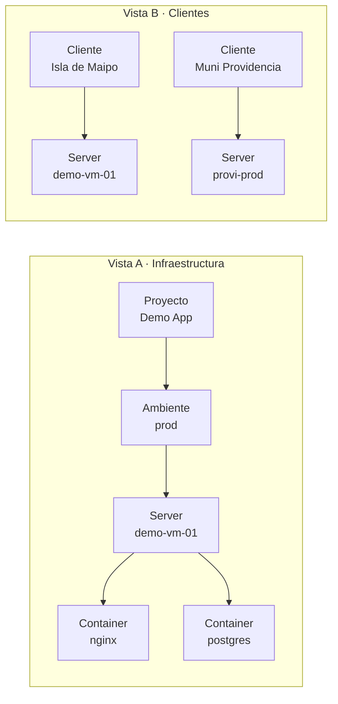
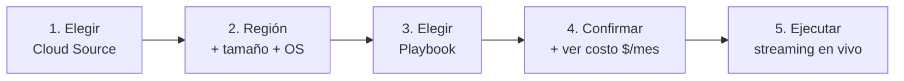
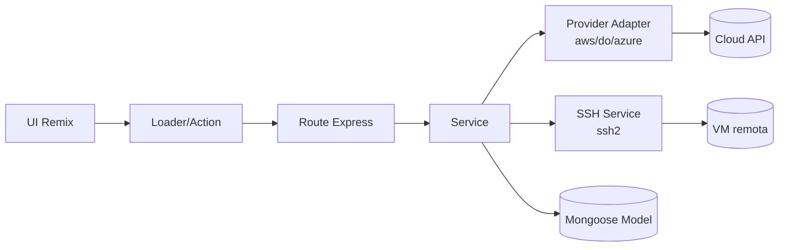
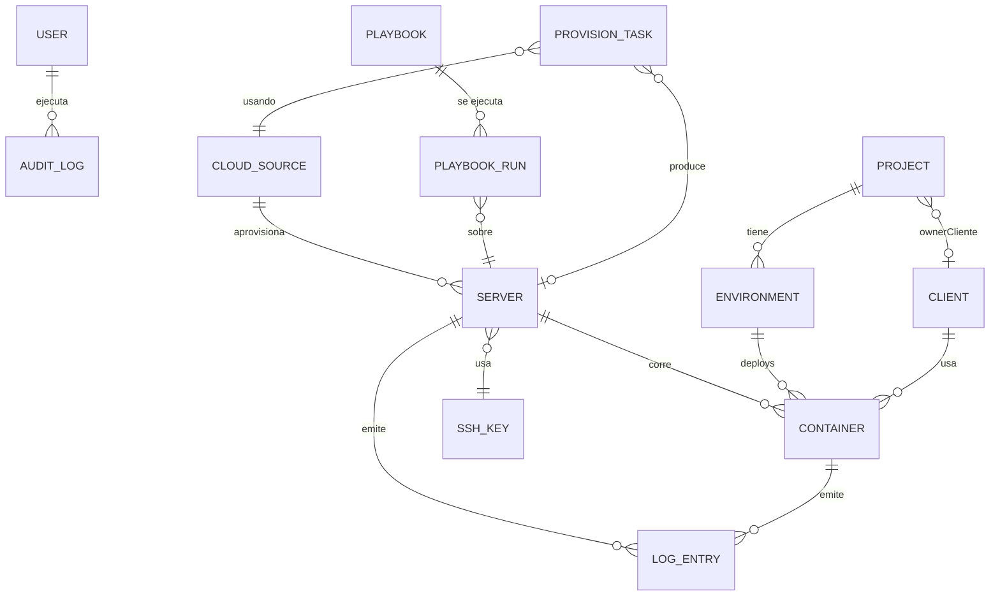
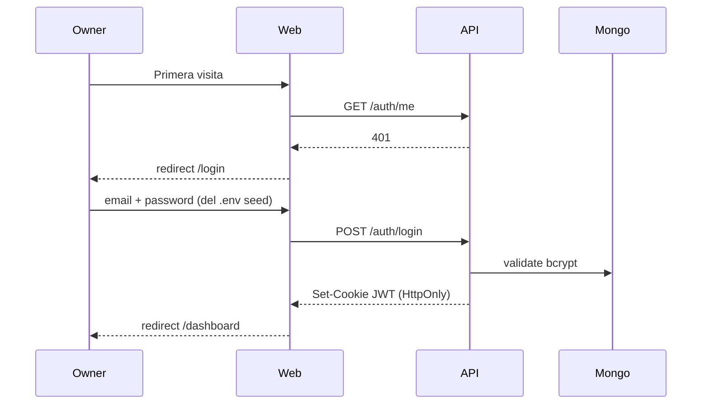
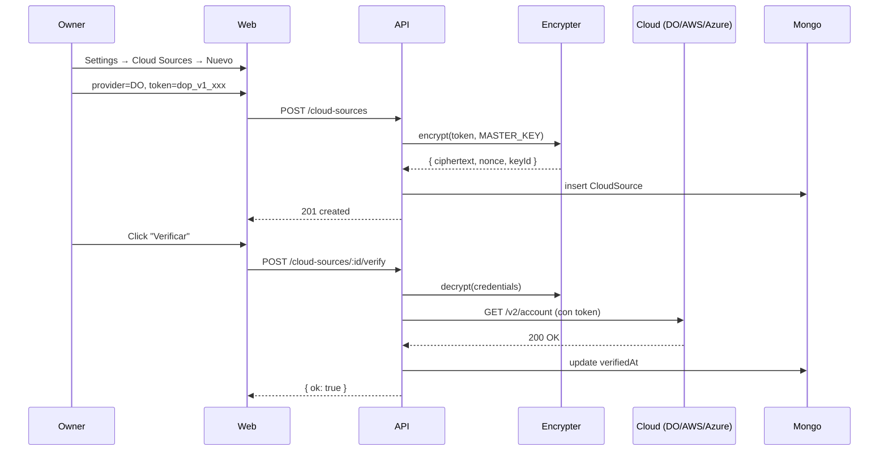
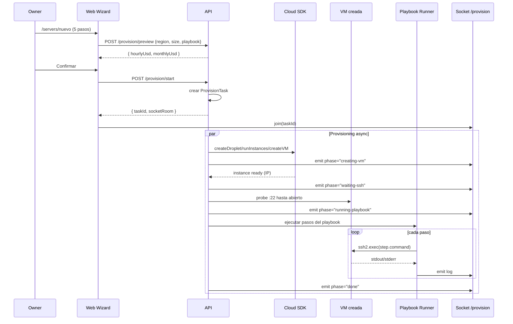
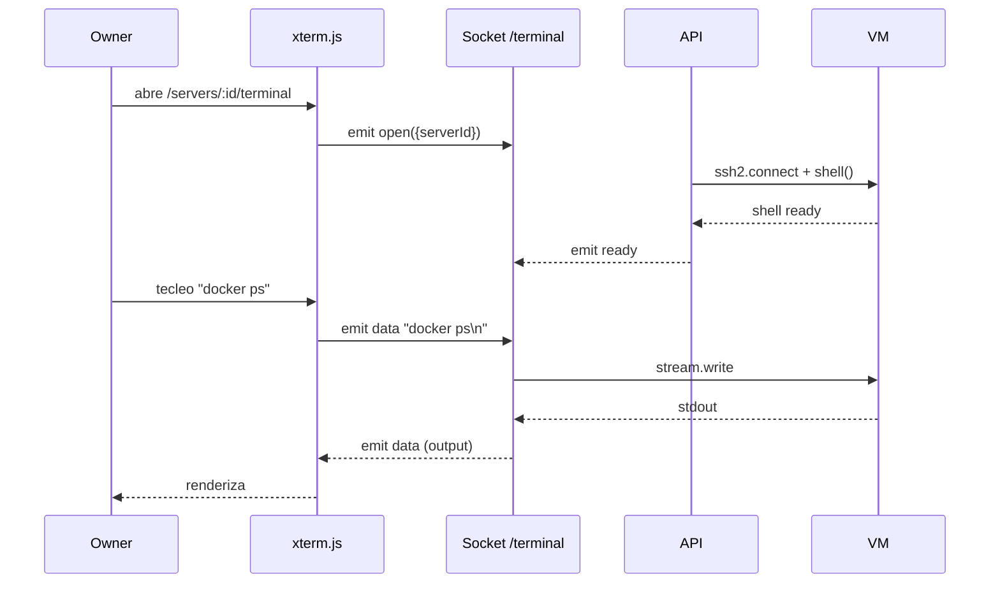
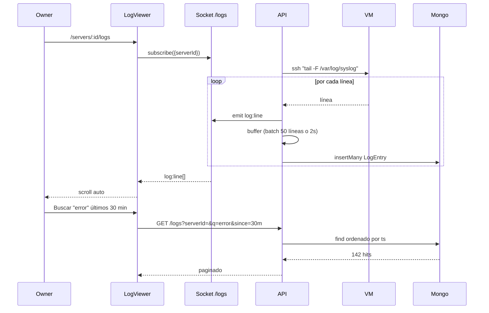
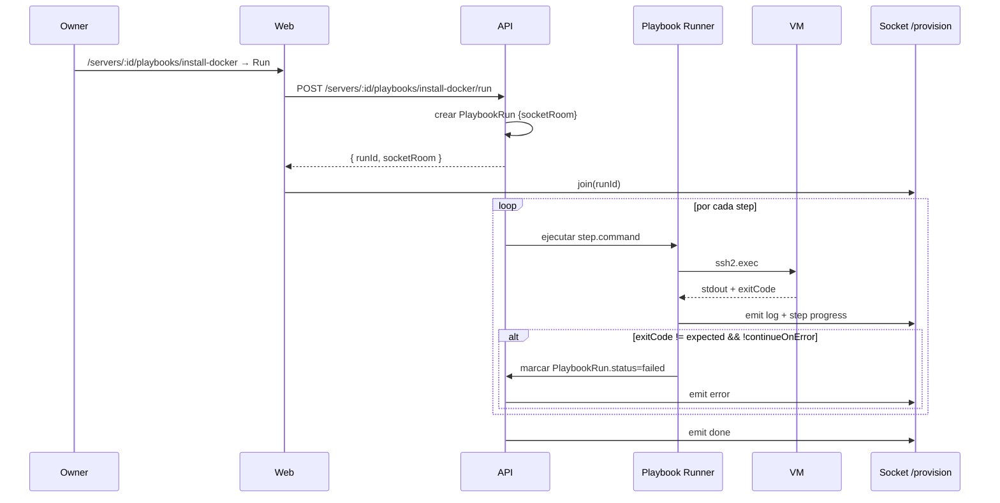

# Inframonitor — Documento de concepto

> Plataforma web personal para visualizar y operar infraestructura distribuida
> en varios proveedores cloud (AWS, DigitalOcean, Azure) desde un solo lugar.

**Estado:** Fase 1 implementada y verificada · MVP single-tenant · Versión 0.1.0
**Audiencia:** equipo técnico (revisión arquitectura, decisiones, plan)
**Tiempo de lectura:** ~10 minutos

---

## 1. Resumen ejecutivo

Hoy gestionamos infra distribuida entre AWS, DigitalOcean y Azure usando SSH, las consolas web de cada provider y scripts sueltos. Eso es lento, repetitivo y propenso a errores. **Inframonitor centraliza tres capacidades** en una sola UI:

1. **Visibilidad** — dos mapas visuales de la infra: uno técnico (servidor → contenedores → ambientes → proyectos) y otro por cliente final (qué deploy usa cada uno).
2. **Operación** — terminal SSH embebido en el navegador + logs en vivo + búsqueda en buffer de las últimas 24 h.
3. **Provisioning estandarizado** — wizard que crea una VM en cualquiera de los 3 providers y le aplica un *playbook* (instalar Docker, Docker + Traefik, bootstrap Node, hardening SSH, etc.) con streaming del progreso.

Es un MVP **single-tenant** (uso personal del owner), construido con un stack mainstream (Remix + Express + MongoDB + Socket.IO) para que cualquier dev TypeScript pueda contribuir sin curva extra.

---

## 2. Problema que resuelve

| Hoy | Con Inframonitor |
|---|---|
| Saltamos entre AWS Console, DigitalOcean, Azure Portal | Una sola UI consolidada |
| Recordamos manualmente qué cliente vive en qué server | Vista "Clientes" con el mapeo explícito |
| Copiar/pegar comandos `apt install docker-ce` por SSH | Catálogo de playbooks ejecutables con un click |
| `ssh user@1.2.3.4` + `tail -f` + `grep` en otra ventana | Terminal y logs en el navegador, en pestañas |
| Estimar costos sumando facturas | Costo mensual estimado por servidor |
| Sin auditoría de quién hizo qué | `AuditLog` de operaciones sensibles |

El público de la herramienta es **el operador técnico** que ya sabe lo que quiere hacer — no es PaaS, es un "Mission Control" personal.

---

## 3. Visión y objetivos

### Visión a 6 meses
Cualquier servidor nuevo del usuario nace, se configura, se monitorea y se destruye **desde Inframonitor**. Las consolas cloud nativas pasan a ser un fallback.

### Objetivos del MVP (Fase 1 → Fase 7)
- ✅ Modelo de datos completo para los 3 providers y el grafo de topología.
- ✅ Render del grafo en `react-flow` con seed (Fase 1).
- 🚧 Auth real + CRUD UI (Fase 2).
- 🚧 Importar instancias reales de AWS/DO/Azure (Fase 3).
- 🚧 SSH terminal web + sync de containers (Fase 4).
- 🚧 Logs streaming + buffer 24 h (Fase 5).
- 🚧 Catálogo de playbooks + ejecución con streaming (Fase 6).
- 🚧 Wizard de provisioning real end-to-end (Fase 7).

### No-objetivos (explícitos)
- ❌ No es una plataforma multi-tenant SaaS.
- ❌ No reemplaza Datadog/Grafana/Prometheus. Logs son operacionales (24 h), no históricos analíticos.
- ❌ No es Terraform: usa SDK cloud directo (más simple, sin estado HCL extra).
- ❌ No corre código de usuario (no es PaaS, no es Heroku).

---

## 4. Capacidades del producto

### 4.1 Visualización — dos vistas sobre los mismos datos



- **Vista A** responde *"¿Qué corre en mis servidores?"*
- **Vista B** responde *"¿Qué servidores impacto si toco al cliente X?"*

Ambas se renderizan con `@xyflow/react`. El backend agrupa los datos (`/api/v1/topology/infrastructure` y `/api/v1/topology/clients`) y devuelve `nodes + edges` listos para pintar — el frontend sólo renderiza.

### 4.2 Operación

**Terminal web**: cada servidor tiene un tab "Terminal" embebido con `xterm.js`. El backend mantiene un canal `ssh2.shell()` y propaga eventos por Socket.IO en el namespace `/terminal`.

**Logs en vivo**: vista de "live tail" con auto-scroll y filtros por nivel (debug/info/warn/error). El backend lanza `tail -F /var/log/syslog` o `docker logs -f <id>` por SSH **sólo cuando hay un suscriptor activo** en el namespace `/logs` — evita gastar conexiones SSH si nadie está mirando.

**Búsqueda histórica (24 h)**: cada línea recibida también se persiste en MongoDB con un **TTL index** (`expireAfterSeconds: 86400`). Buscar "error connection refused" en los últimos 30 min es una query indexada normal.

### 4.3 Provisioning estandarizado

Wizard de 5 pasos:



El paso 5 muestra fase por fase: `creating-vm → waiting-ssh → running-playbook → done`. Si algo falla en `running-playbook`, la VM queda creada en estado `bootstrapStatus=failed` y se ofrece **"reintentar playbook"** sin re-crearla.

---

## 5. Stack tecnológico

Stack TypeScript moderno, todo runtime Node ≥ 20, sin dependencias exóticas.

| Capa | Elección | Por qué |
|---|---|---|
| **Monorepo** | pnpm workspaces (`apps/*`, `packages/*`) | Familiar al equipo, build incremental |
| **Frontend** | Remix + TypeScript + Tailwind 3 + Radix UI + Zustand | Server-side rendering (rápido), formularios nativos, librería UI accesible |
| **Topología visual** | `@xyflow/react` | API estable, nodos custom + minimap + controls, performance suficiente para cientos de nodos |
| **Terminal web** | `@xterm/xterm` + `@xterm/addon-fit` | Estándar de facto; resize + colors + keybindings |
| **Backend** | Express + TypeScript + Socket.IO + pino | Stack maduro, simple de operar y debuggear |
| **SSH** | `ssh2` (Node, directo) | Bajo nivel necesario para `shell()` interactivo y streaming de logs |
| **Persistencia** | MongoDB + Mongoose 8 | Documentos flexibles para `wizardSnapshot`, `playbookRun.output`, `containerLabels`; TTL nativo para logs |
| **Cifrado de credenciales** | `libsodium-wrappers` (XSalsa20-Poly1305 secretbox) | API resistente a uso incorrecto; nonce + ciphertext + keyId para rotación |
| **AWS** | `@aws-sdk/client-ec2`, `client-sts`, `client-pricing` | SDK v3 modular (bundles pequeños) |
| **DigitalOcean** | `dots-wrapper` | API REST simple, tipada |
| **Azure** | `@azure/arm-compute`, `arm-network`, `arm-resources`, `@azure/identity` | Provisioning Azure requiere 3 SDKs (resource group + vnet + nic + vm) |
| **Cron interno** | `node-cron` | Sync de estado VMs, refresh costos |
| **Auth** | JWT en cookie HttpOnly + bcrypt | Simple, suficiente para single-tenant |
| **Validación** | `zod` | Schemas que sirven para tipos y validación |
| **Logger** | `pino` + `pino-pretty` (dev) | Performance, JSON estructurado en prod |
| **Dev/Deploy** | Docker Compose | Sólo Mongo en contenedor; API y Web nativos para hot-reload |

**Seguridad en dependencias (preferencia del equipo)**: `.npmrc` con `minimum-release-age=1440` (no instalar releases con menos de 24 h) e `ignore-scripts=true` (bloquea preinstall/postinstall maliciosos). Defensa contra ataques de supply chain del estilo TanStack/Mistral.

---

## 6. Arquitectura

### 6.1 Diagrama de despliegue

```mermaid
flowchart TB
  subgraph Cliente["🌐 Navegador"]
    UI[Remix UI<br/>react-flow + xterm]
  end

  subgraph Servidor["🖥️ Server local / VPS"]
    subgraph Apps["apps/"]
      Web[apps/web<br/>Remix · :5274]
      API[apps/api<br/>Express + Socket.IO · :8301]
    end
    subgraph Pkgs["packages/"]
      DB[(MongoDB<br/>:27117)]
      Shared[@inframonitor/<br/>database + shared-types]
    end
  end

  subgraph Clouds["☁️ Providers"]
    AWS[AWS EC2]
    DO[DigitalOcean]
    AZ[Azure VM]
  end

  subgraph VMs["🖥️ Servidores gestionados"]
    VM1[VM]
    VM2[VM]
  end

  UI -->|HTTPS + WS| Web
  Web -->|loader/action| API
  UI -.->|Socket.IO directo| API
  API --> DB
  API -->|SDK| AWS & DO & AZ
  API -->|ssh2| VM1 & VM2
```

### 6.2 Estructura del monorepo

```
inframonitor/
├── apps/
│   ├── api/                  # Express + Socket.IO + Mongoose
│   │   └── src/
│   │       ├── main.ts       # bootstrap
│   │       ├── routes/       # /topology, /servers, /cloud-sources, ...
│   │       ├── services/     # lógica de negocio (topology, ssh, provisioning)
│   │       ├── sockets/      # /terminal, /logs, /provision
│   │       ├── providers/    # adaptadores AWS/DO/Azure
│   │       ├── playbooks/    # runner de pasos
│   │       └── scripts/      # init-db, seeds
│   └── web/                  # Remix
│       └── app/
│           ├── routes/       # infraestructura, clientes, servers/$id, …
│           ├── components/   # TopologyCanvas, Terminal, LogViewer
│           ├── stores/       # zustand (UI, wizard, terminal)
│           └── lib/          # api.server.ts, cn.ts
└── packages/
    ├── database/             # Modelos Mongoose
    │   └── src/entities/<Name>/{schema.ts, index.ts}
    └── shared-types/         # Enums, DTOs, eventos socket
```

### 6.3 Capas lógicas



**Regla de oro**: la lógica vive en `services/`. Las rutas son delgadas (validan zod + llaman service). Los providers son adaptadores con la misma interfaz para los 3 clouds.

---

## 7. Modelo de datos

13 entidades Mongoose, una carpeta por entidad en `packages/database/src/entities/`.



**Convenciones**:
- `id` UUID propio en cada entidad (los IDs de `react-flow` deben ser strings simples — no ObjectId).
- Soft delete con `deletedAt: Date | null`.
- `LogEntry` con TTL index 86 400 s sobre `ts` (Mongo barre solo).
- Campos sensibles (`User.passwordHash`, `CloudSource.credentials`, `SshKey.privateKeyEncrypted`) se omiten en `toJSON` — **nunca** llegan al cliente.
- Credenciales cloud: sub-doc `{ ciphertext, nonce, keyId }` cifrado con libsodium; `keyId` permite rotar la `MASTER_KEY`.

---

## 8. Flujos de usuario

### 8.1 Onboarding inicial (un solo usuario)



El `OWNER_EMAIL` y `OWNER_PASSWORD` viven en `.env` y se seedean en `init-db`. Single-tenant: no hay registro abierto.

### 8.2 Conectar un Cloud Source



### 8.3 Crear un servidor (wizard de provisioning)



### 8.4 Conectar SSH desde el navegador



### 8.5 Ver logs en vivo + buscar histórico



### 8.6 Ejecutar un playbook sobre un server existente



---

## 9. Plan de implementación (7 fases)

Cada fase es **entregable independiente** con git tag, smoke test y plus visible para el usuario.

| Fase | Entregable | Smoke test | Estado |
|---|---|---|---|
| **1** | Esqueleto monorepo + 1 servidor mock en `/infraestructura` | `pnpm dev` → ver grafo seed | ✅ Hecho |
| **2** | Auth real + CRUD UI completo | Crear 3 servers desde UI, alternar Vista A↔B | ⏳ |
| **3** | Cloud Sources + import read-only AWS/DO/Azure | Importar droplets reales, ver IP + costo | ⏳ |
| **4** | SSH terminal web + sync de containers | `docker ps` desde el browser | ⏳ |
| **5** | Logs streaming + buffer 24 h con búsqueda | `logger 'x'` externo → línea aparece <2s + buscable | ⏳ |
| **6** | Catálogo de playbooks + ejecución streaming | `install-docker` → `docker --version` OK | ⏳ |
| **7** | Wizard provisioning end-to-end | Wizard crea droplet $4/mes, instala Docker, destruye | ⏳ |

Tags: `v0.1.0` … `v0.7.0`.

---

## 10. Ventajas

### 10.1 Para el operador (DX y velocidad)
- **One-stop shop**: ya no hay que recordar qué consola cloud abrir.
- **Onboarding de nuevo server: minutos, no horas.** Wizard estandariza Docker/Traefik en vez de copy-paste manual.
- **Mapeo cliente → infra explícito.** Antes vivía en la cabeza del operador; ahora es data en Mongo.
- **Terminal y logs sin abrir más ventanas.** Todo en pestañas dentro del mismo browser.

### 10.2 Para el equipo (mantención)
- **Stack mainstream TS.** Cualquier dev con experiencia en Remix o Express puede contribuir sin onboarding largo.
- **Monorepo pnpm con build incremental.** `packages/database` compila una vez, web y api lo consumen.
- **Modelos en un solo paquete** (`@inframonitor/database`). No hay duplicación entre apps.
- **Tipos compartidos** (`@inframonitor/shared-types`). El payload del endpoint de topología es exactamente el mismo tipo que renderiza el componente — refactor seguro.
- **Backend agrupa, frontend pinta.** Evita lógica de negocio duplicada en cliente.

### 10.3 Para la seguridad
- **Credenciales cifradas en reposo** (libsodium) y **omitidas en respuestas API** (toJSON las borra).
- **Llaves SSH gestionadas dentro** de la app, no esparcidas por el filesystem.
- **`AuditLog`** de operaciones sensibles (acceso a credenciales, terminate de VM, ejecución de playbook).
- **Supply chain endurecida**: `.npmrc` con `minimum-release-age=1440` + `ignore-scripts=true`. Defensa contra ataques tipo TanStack.

### 10.4 Para el costo
- **MVP single-tenant**: no necesita escalado horizontal, autoscaling ni multi-region. Un VPS de $10/mes lo aloja sin sudar.
- **Mongo único**, sin Redis/Postgres/Elasticsearch.
- **Sin Datadog/New Relic**: usamos los propios logs con TTL 24 h, suficientes para troubleshooting reactivo.

---

## 11. Riesgos y mitigaciones

| Riesgo | Probabilidad | Impacto | Mitigación |
|---|---|---|---|
| Credenciales cloud filtradas | Baja | Crítico | libsodium en reposo, omitidas en API, IAM users mínimos privilegios, AuditLog |
| Costo accidental de VMs en testing Fase 7 | Media | Medio | Wizard sugiere "nano" ($4-6/mes), costo prominente antes del paso final, botón rápido Terminate |
| Drift entre estado real cloud y DB | Alta | Bajo | Cron reconciliación 5 min + botón "Refresh" + `lastSyncedAt` visible |
| Provisioning falla a la mitad | Media | Medio | Cada paso idempotente; si VM creada pero playbook falló → `bootstrapStatus=failed` con botón "reintentar" sin re-crear |
| Logs explotan Mongo | Baja | Medio | TTL 24 h + tail solo con suscriptor + batch insert + monitor `db.stats()` en `/health` |
| `ssh2` channels colgados | Media | Bajo | Keepalive, timeout en exec, cleanup en disconnect, cap de sesiones |
| Azure multi-recurso (RG+VNet+NIC+VM) falla parcial | Media | Alto | Encapsular en `azure-provisioner.service.ts`; rollback de recursos creados si falla a la mitad |
| Master key rotation | Alta (largo plazo) | Bajo si hay endpoint | Endpoint admin `rotate-key` re-cifra todos los `CloudSource.credentials` con nuevo `keyId` |

---

## 12. Mantención y operación

### 12.1 Cómo arrancar el proyecto en local

```bash
# Una sola vez
cp .env.example .env
# editar JWT_SECRET, OWNER_PASSWORD, MASTER_KEY
pnpm install

# Cada vez
pnpm dev
# levanta Mongo (Docker) + init-db + API + Web
```

### 12.2 Cómo agregar una nueva entidad

1. `packages/database/src/entities/<name>/schema.ts` — define el schema con `applyBaseSchema(...)`.
2. `packages/database/src/entities/<name>/index.ts` — exporta `<Name>Model` con el patrón
   ```ts
   import mongoose, { type Model } from "mongoose";
   const { model, models } = mongoose;
   ```
   (importante: Mongoose 8 + ESM no expone named exports en runtime).
3. Re-exportar desde `packages/database/src/index.ts`.
4. `pnpm build:packages`.
5. Agregar rutas y servicio en `apps/api/src/`.

### 12.3 Cómo agregar un nuevo playbook built-in

Editar `apps/api/src/scripts/init-db.ts` → función `seedPlaybooks()` → agregar objeto al array `builtins`. El runner ejecuta `steps[]` en orden con `ssh2.exec`.

Para playbooks de usuario: la UI en `/playbooks` permite crear con editor YAML, persisten con `isBuiltin: false`.

### 12.4 Cómo agregar un nuevo provider cloud

1. Crear `apps/api/src/providers/<provider>/index.ts` implementando la interfaz `CloudProvider` con métodos `verify()`, `listInstances()`, `createInstance()`, `terminateInstance()`, `getPricing()`.
2. Agregar `"<provider>"` a `PROVIDERS` en `packages/shared-types/src/enums.ts`.
3. Agregar el enum a los `enum:` de `Server.provider` y `CloudSource.provider` en sus schemas.
4. Agregar pricing al catálogo local.

### 12.5 Observabilidad de la propia plataforma

- `/health` (sin auth) — readiness check con estado de Mongo y uptime.
- `pino` con `pino-pretty` en dev, JSON estructurado en prod.
- Logs propios en `data/logs/{api,web}.log` (no commitear).

### 12.6 Backups
- Mongo: dump diario del volumen `inframonitor_mongodb_data`.
- Credenciales cifradas son inútiles sin `MASTER_KEY` → backup separado de la key en password manager.

---

## 13. Próximos pasos sugeridos para el equipo

1. **Revisar este documento** y dar feedback sobre arquitectura/scope.
2. **Probar Fase 1 en local** (`pnpm dev` → http://localhost:5274/infraestructura).
3. **Decidir fase prioritaria a iniciar** post-1 (recomendación: Fase 2 — auth + CRUD).
4. **Validar la lista de playbooks built-in** que vienen seedeados (install-docker, docker-traefik por ahora; ¿añadimos hardening, nodejs, postgres standalone?).
5. **Acordar criterios de "Done" por fase** (test smoke ya está descrito; ¿añadimos tests automatizados con vitest?).

---

## Anexo A · Decisiones clave (registro)

| # | Decisión | Por qué | Cuándo |
|---|---|---|---|
| 1 | MongoDB en vez de Postgres | Documentos flexibles (`wizardSnapshot`, labels Docker, logs); TTL nativo | Diseño inicial |
| 2 | SDK cloud directo, no Terraform | Menos estado HCL que mantener, más control fino, sin proceso externo | Conversación con usuario |
| 3 | Los 3 providers (AWS+DO+Azure) desde el inicio | Necesidad real del usuario; encapsular adapter pattern temprano | Conversación con usuario |
| 4 | Playbooks YAML en DB, no en código | Editables sin rebuild; built-ins se seedean | Conversación con usuario |
| 5 | Logs híbridos (stream + buffer 24 h Mongo TTL) | Live tail sin overhead de SaaS de logs; búsqueda corta sin pipeline | Conversación con usuario |
| 6 | Single-tenant MVP, no multi-org | Necesidad inmediata es uso personal | Conversación con usuario |
| 7 | `@xyflow/react` para topología | Maduro, nodos custom y minimap suficientes para esta escala | Diseño inicial |
| 8 | Remix server-side para fetch a la API | Loaders son la primitiva natural; evita exponer API URL al cliente | Diseño inicial |
| 9 | `id` UUID propio además del `_id` | xyflow exige IDs string simples; estabilidad ante migraciones de Mongo | Diseño inicial |
| 10 | `.npmrc` con `minimum-release-age=1440` | Defensa supply-chain ante ataques tipo TanStack | Preferencia global del owner |

---

## Anexo B · Glosario rápido

- **Cloud Source**: cuenta cloud configurada en Inframonitor (AWS account, DO team, Azure subscription).
- **Server**: VM gestionada (importada o creada).
- **Container**: contenedor Docker corriendo en un Server.
- **Project**: agrupación lógica de código/servicio (ej. "Pagos API").
- **Environment**: instancia de un Project (dev/staging/prod/qa).
- **Client**: tenant final que usa los recursos (ej. "Isla de Maipo").
- **Playbook**: receta YAML/JSON con pasos que se ejecutan por SSH.
- **PlaybookRun**: una ejecución específica de un Playbook sobre un Server.
- **ProvisionTask**: orden de aprovisionamiento desde el wizard (incluye crear VM + correr playbook).
- **MASTER_KEY**: clave simétrica de libsodium que cifra todas las credenciales cloud y SSH.
- **TOFU**: Trust On First Use — aceptar el fingerprint del host SSH la primera vez y persistirlo en `Server.ssh.hostFingerprint`.

---

*Documento mantenido en `docs/CONCEPTO.md` · Versión 1.0 · 2026-05-27*
